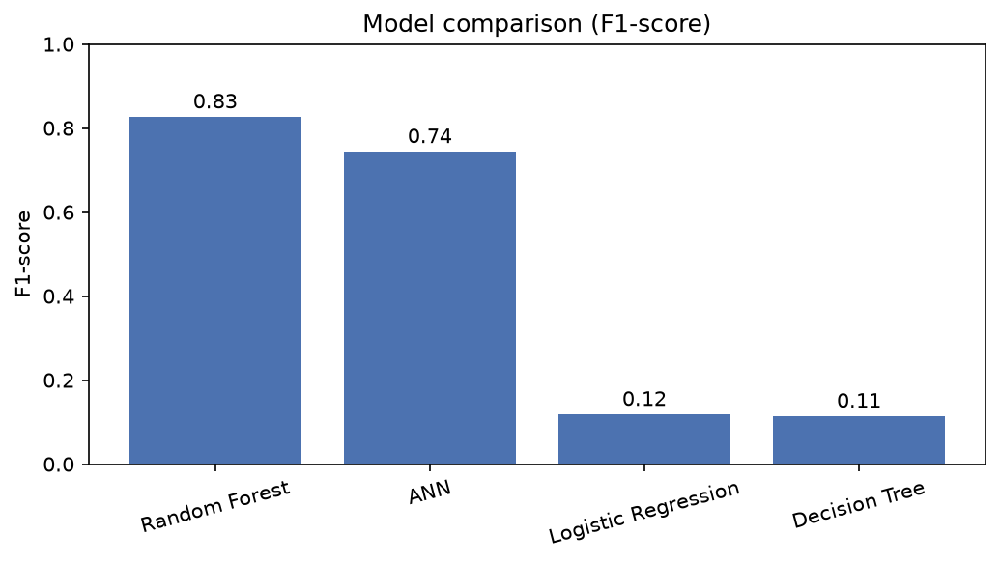
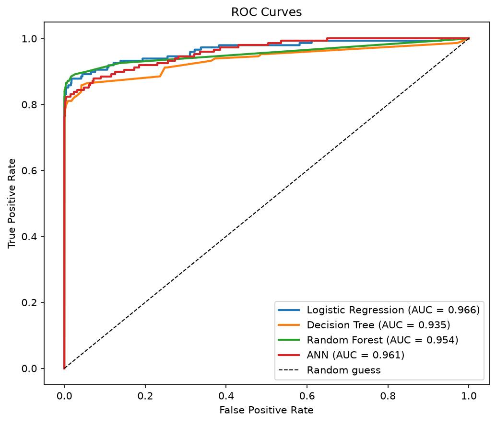
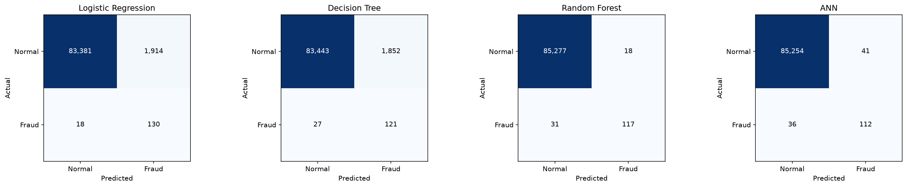

# Credit Card Fraud Detection

A Bachelor diploma project that detects fraudulent credit-card transactions using machine learning.
Four models are trained and compared: **Logistic Regression, Decision Tree, Random Forest, and an Artificial Neural Network (ANN)**.

---

## Requirements

- Python 3.10 or newer → [python.org/downloads](https://www.python.org/downloads/) *(tick "Add python.exe to PATH" during install)*
- The dataset → download `creditcard.csv` from [kaggle.com/datasets/mlg-ulb/creditcardfraud](https://www.kaggle.com/datasets/mlg-ulb/creditcardfraud) and place it in the `data/` folder

---

## How to run

**Step 1 — Install the required libraries** *(only once)*

```bash
pip install -r requirements.txt
```

**Step 2 — Train and evaluate the models**

```bash
python main.py
```

This will preprocess the data, train all four models, print the results, and save charts to the `outputs/` folder.

**Step 3 — Open the web interface** *(optional)*

```bash
streamlit run app.py
```

Then open [http://localhost:8501](http://localhost:8501) in your browser. From there you can pick a transaction from the dataset, upload a CSV, or enter values manually — and the app will tell you whether it is fraud or not.

---

## Project structure

```
credit-card-fraud-detection/
│
├── data/
│   └── creditcard.csv          ← place the Kaggle dataset here
│
├── src/
│   ├── config.py               ← paths and settings
│   ├── data_preprocessing.py   ← scaling, train/test split, SMOTE
│   ├── train_models.py         ← builds and trains the four models
│   ├── evaluate_models.py      ← metrics, charts, comparison table
│   └── predict.py              ← classifies a single transaction
│
├── main.py                     ← runs the full pipeline
├── app.py                      ← Streamlit web interface
└── requirements.txt            ← Python dependencies
```

---

## Results

### F1-score comparison



### ROC curves



### Confusion matrices



---

## Dataset

**Credit Card Fraud Detection** — Kaggle (European cardholders, September 2013)

- 284,807 transactions — only 492 are fraud (0.17%)
- Features `V1`–`V28` are anonymised via PCA; `Time`, `Amount`, and `Class` are the original columns
- `Class`: 1 = fraud, 0 = normal
